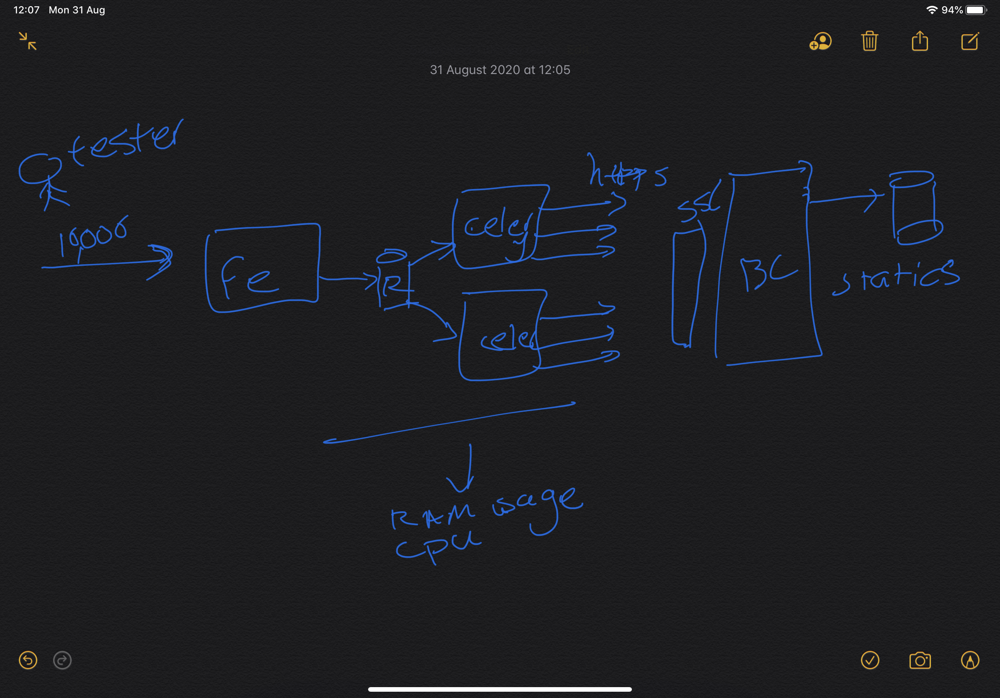

# python-celery-benchmark
This is a repository that we want to get some ideas how celery would work at scale. (however you may see some other benchmarks too)

# Architecture

The following image will try to explain the architecture:

We need three apps based on the following architecture:
- A frontend (http server) to push as many as tasks needed or get status of queue
- A celery worker that use redis as queue and send https request to backend services
- A backend service that accept only https and and record request / response statistics

